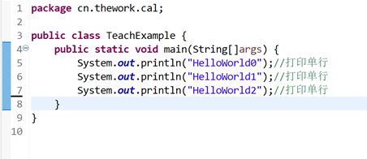

# Untitled

## 变量

在前面的章节中我们已经学习了第一个Java程序，打印helloWorld  
这次我们来尝试一些不一样的：打印多行【HelloWorld】




              输出结果如下图所示:


这里我们使用了多次System.out.println\(\)方法来输出文本

这种方法虽然用起来是能达到我们的目的，但是……

同学A：写这么多行太麻烦了


有一说一，的确。

那么有没有一种可以多次输出同一个文本呢？

这里就涉及到我们的变量概念了，我们这里先写以下代码：

```java
public class TeachExample {
    public static void main(String[]args) {
       String X = "HelloWorld";
       System.out.println(X);
       System.out.println(X);
       System.out.println(X);
    }
}
```

这里会输出以下结果：


我们对以上代码进行讲解：

首先，我们确定了一个名字叫X的文本（String）变量，并声明这个文本变量的内容为"HelloWorld"（不带引号）：

```java
String X = "HelloWorld";
```

然后我们把X变量放入System.out.println\(\)方法内，执行多次System.out.println\(X\)方法

```java
       System.out.println(X);
       System.out.println(X);
       System.out.println(X);
```

即可输出三次X文本。

怎么样？是不是一下子变得很简单了呢？

### 变量为什么是变量？

变量为什么叫变量呢？说白了就是一个可变的量  
我可以让它变为“HelloWorld”，也可以让它变为“HelloJava“

口头说没有代码好理解：

```java
public class TeachExample {
    public static void main(String[]args) {
       String X = "HelloWorld";
       System.out.println(X);
       System.out.println(X);
       System.out.println(X);
       X = "HelloJava";
       System.out.println(X);
       System.out.println(X);
       System.out.println(X);
    }
}
```

我们还是像刚刚一样，定义了一个X变量为“HelloWorld”：

```java
       String X = "HelloWorld";
```

然后同样输出三次X文本：System.**out**.println\(X\);

```java
       System.out.println(X);
       System.out.println(X);
       System.out.println(X);
```

接着我们又把X改成了“HelloJava”：

```java
       X = "HelloJava";
```

（我们刚刚已经声明X为文本（String）变量了，这里我们就不需要再声明一次）

然后再输出三次：System.**out**.println\(X\);

```java
       System.out.println(X);
       System.out.println(X);
       System.out.println(X);
```

得到如下所示的结果：


 怎么样？是不是已经了解每一步的用意了？

